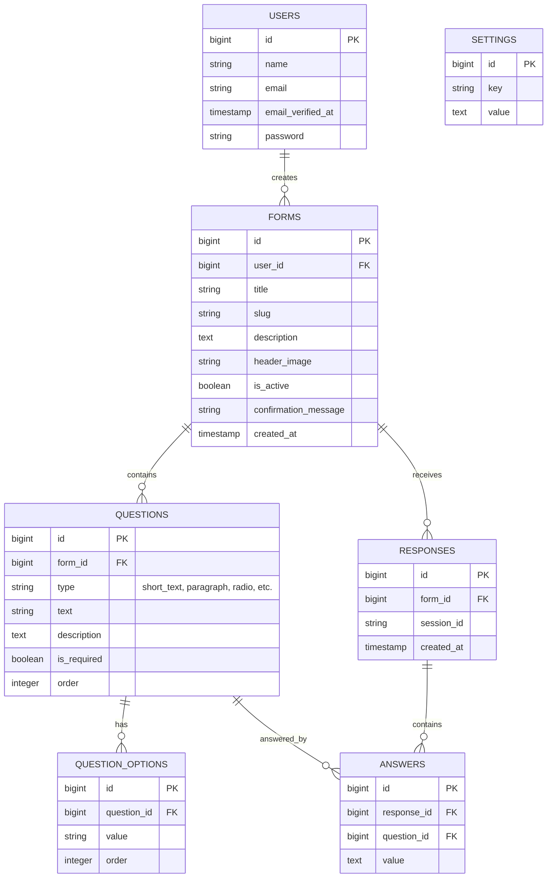

# EduForm - Modern Form Builder Assessment


EduForm is a modern, responsive, and intuitive Form Builder application developed specifically for the **Ozan Project** assessment. It provides an app-like experience for both the form creators (administrators) and the respondents.

---

## 🚀 Features
- **App-like Landing Page**: Modern UI with glassmorphism, responsive components, and dynamic branding.
- **Dynamic Branding**: The Application name, subtitle, and logo can be managed dynamically through the settings panel.
- **Advanced Form Builder**: Drag-and-drop-like feeling, allowing creators to build various question types:
  - Short Text
  - Paragraph
  - Radio Button
  - Checkboxes
  - Dropdown
  - Date
  - Time
  - File Upload (Docs / Images)
- **Live Form Responses**: Real-time view of collected data with search, pagination, and data export options.
- **Responsive Design**: Built purely with Tailwind CSS, ensuring 100% responsiveness on Mobile, Tablet, and Desktop screens.
- **Anti-Spam Mechanism**: Built-in "I'm not a robot" instantaneous verification UI using AlpineJS and secure Livewire backend validation to prevent bot spam.

---

## 📋 PRD (Product Requirements Document)

### 1. Objective
To build a scalable, maintainable, and highly responsive Form Builder web application that enables users to create customizable forms, gather responses, and manage data efficiently.

### 2. Target Audience
- **Administrators**: Users who create, publish, and manage forms and analyze the submitted responses.
- **Respondents**: End-users who access the public form link to submit answers or upload files.

### 3. Key Requirements
- **Authentication**: Secure Login/Registration for form creators.
- **Dashboard**: A central hub to manage created forms.
- **Form Editor**: Must support setting titles, descriptions, banner headers, and multiple question types with validation (required/optional).
- **Public Form Link**: A unique, shareable URL for each form.
- **Data Collection**: Secure storing of form responses and file uploads up to 5MB.
- **Security**: Must implement bot protection before form submission.
- **Settings**: Global configuration to customize the application’s branding (name, logo, etc.).

### 4. Tech Stack
- **Framework**: Laravel 11.x
- **Frontend/Reactivity**: Livewire 3 + Alpine.js
- **Styling**: Tailwind CSS 3
- **Database**: MySQL / SQLite

---

## 🗄️ ERD (Entity Relationship Diagram)



---

## 🛠️ Installation & Setup

If you want to run this project locally, follow these steps:

### Prerequisites
- PHP 8.2 or higher
- Composer
- Node.js & npm
- MySQL or SQLite

### 1. Clone the Repository
```bash
git clone https://github.com/OzanProject/Eduform.git
cd Eduform
```

### 2. Install Dependencies
```bash
composer install
npm install
```

### 3. Environment Configuration
Copy the `.env.example` file and configure your database variables:
```bash
cp .env.example .env
php artisan key:generate
```

### 4. Run Migrations & Seeder (Optional)
```bash
php artisan migrate --seed
```

### 5. Link Storage (Crucial for File Uploads and Logos)
```bash
php artisan storage:link
```

### 6. Build Frontend Assets
*(Note: Production build files are already included in this repository under `/public/build`, but you can rebuild them if you make changes)*
```bash
npm run build
```

### 7. Run the Application
```bash
php artisan serve
```
Visit `http://localhost:8000` in your browser.

---

## 👨‍💻 Development

Developed by **Ozan Project** as an assessment project. Focuses heavily on best practices, UI/UX, and performance optimization.
